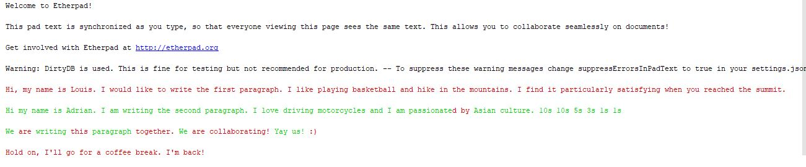
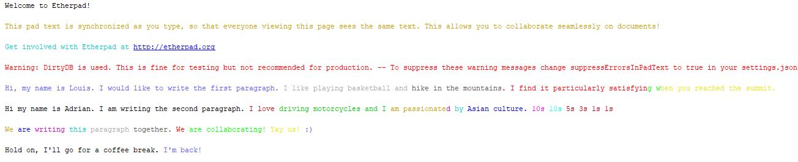
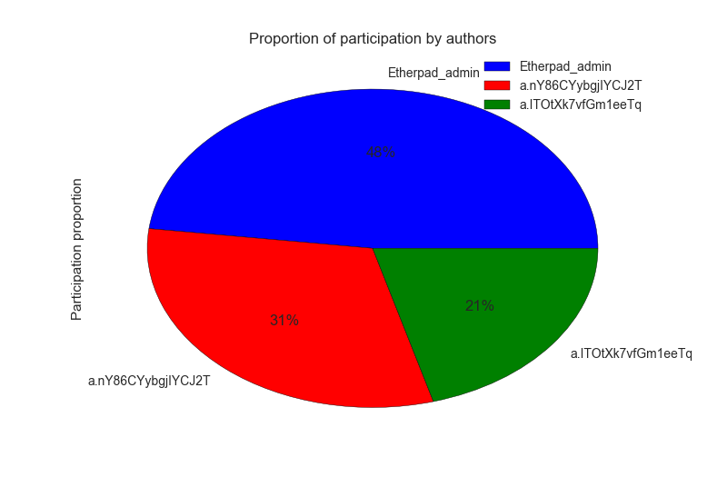
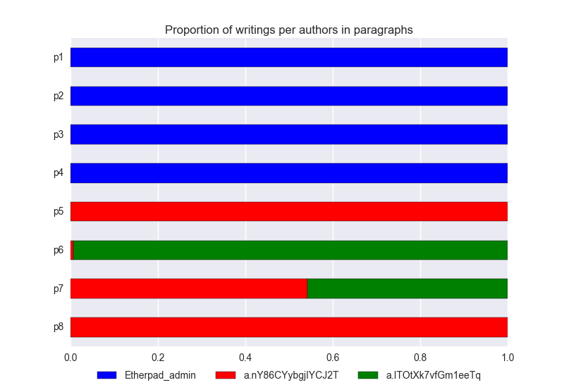
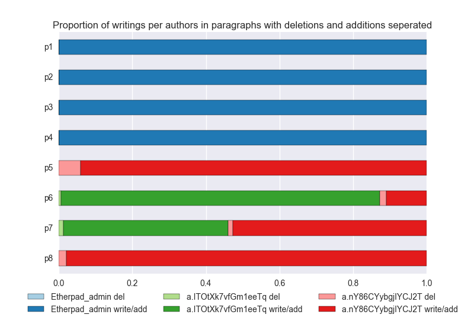
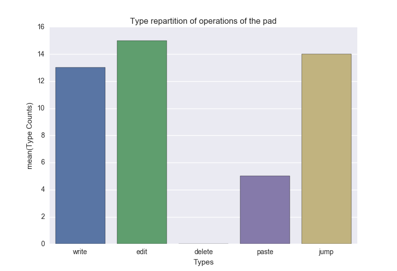
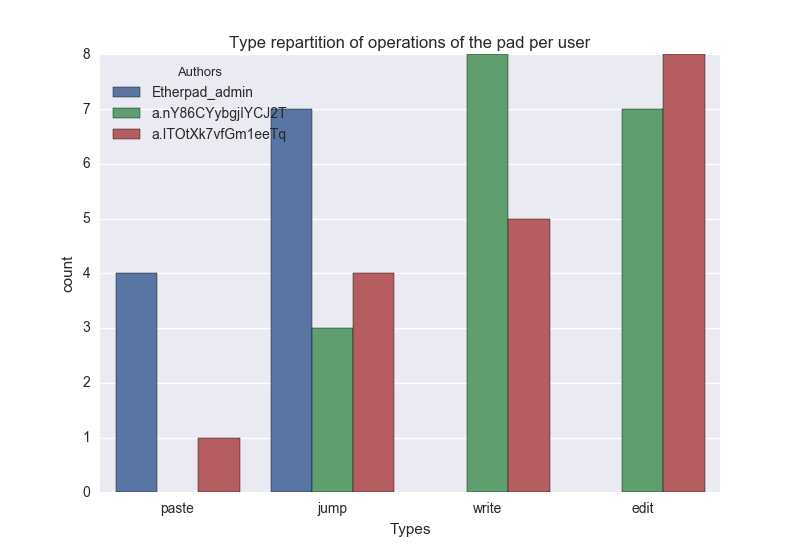

# FROG-analytics

Analytics algorithms and visualizations for collaborative writings.
It currently handle two collaborative document editors, [Etherpad](http://etherpad.org/) and [Collab-react-components](https://github.com/chili-epfl/collab-react-components).

## Setup

### Python Environment
You will need Python3 and the following dependencies.
- csv
- ast
- numpy  
- argparse
- pymongo (if using collab-react-components editor)
- matplotlib
- pandas
- seaborn

```
pip install csv
pip install ast
pip install numpy
pip install argparse
pip install pymongo
pip install matplotlib
pip install pandas
pip install seaborn
```

### Etherpad
You'll need to download etherpad from [http://etherpad.org/](http://etherpad.org/).
Extract it in a folder named etherpad.

You can start etherpad by runnning `start.bat`.  
Then connect to [http://localhost:9001](http://localhost:9001).
> Note:  If you want to join the pad on another terminal, replace localhost by the IP address of the host. Users collaborating need to be on the same network or remotely connect to the host.

Start Editing.

All edits are stored in `etherpad/var/dirty.db`.

(changeset format: [http://policypad.readthedocs.io/en/latest/changesets.html](http://policypad.readthedocs.io/en/latest/changesets.html))

### Collab-react-components
In order to use the text collab editor written by [Dario Anongba](https://github.com/darioAnongba). First install pymango by using:
```
pip install pymongo
```
Clone the program from dario:  [Collab-React-Components](https://github.com/chili-epfl/collab-react-components) in any folder (doesn't have to be in the same folder as the repo).  
Install node.js/npm  
Install react with npm (version 15.4.0+) in Dario's folder
```
git clone https://github.com/chili-epfl/collab-react-components
npm install --save react
npm install --save react-dom
```

`npm init` and `npm install` in root folder and in the demos folder
```
npm init
npm install
cd demos/collab-editor  
npmn init
npm install
```
Replace `server.js` with the corresponding file in this repo so that the edits are stored in the mongo database. Then start the program with `npm start`
```
service mongod start
cd demos/collab-editor
npm start
```

To access the edits, the program will use pymongo.  
To delete the logs, you need to run the python script `drop mongo database.py`
```
python "drop mongo dabase.py"
```


Find a detailed tutorial on [MongoDB](http://api.mongodb.com/python/current/tutorial.html)
(op format [https://github.com/ottypes/text](https://github.com/ottypes/text))

## Usage

In its current state, the program groups the fine grained writing events (`ElementaryOperation`) provided by the editors into `Operations` (list of writing events by the same author in the same place). Then `Paragraphs` are deduced which are the collection of operations in the same line. This allows us to build the context of an operation:  
- Was this operation written while other authors were also working on the doc ? With who ?
- Was this operation written while other authors were also working in the same paragraph ? With who ?
- Is this a prominent author in the doc at the time of the operation?
- Is this a prominent author in the paragraph at the time of the operation ?
- Is this the first operation of the day ? The first after a small break ?  
For the moment we provided a small set visualizations that are detailed in a following section.  


### Execution
We have provided a small command line interface to interact with the program.
```
python analytics.py
```
With the following arguments:  
```
usage: analytics.py [-h] [-p PATH_TO_DB] [-e {etherpad,stian_logs,collab-react-components}] [-t] [-viz] [-v] [subset_of_pads SUBSET_OF_PADS | --specific_pad SPECIFIC_PAD]

Run the analytics.

optional arguments:
  -h, --help            show this help message and exit
  -p PATH_TO_DB, --path_to_db PATH_TO_DB
                        path to database storing the edits
  -e, --editor {etherpad,stian_logs,collab-react-components}
                        What editor are the logs from
  -t, --texts           Print the texts colored by ops and by author
  -viz, --visualization
                        Display the visualization (proportion of participation
                        of the users per pad/paragraph, how synchronous they
                        are...
  -v, --verbosity       increase output verbosity (you can put -v or -vv)
  --subset_of_pads SUBSET_OF_PADS
                        Size of the subset of pads we will process
  --specific_pad SPECIFIC_PAD
                        Process only one pad
 ```

Below are a few examples of execution.

### Examples of execution
##### Etherpad
To launch the program on data collected with the Etherpad editor. You can launch the following command:

```
python analytics.py -p "etherpad/dirty.db" -e etherpad -t -viz -v --specific_pad "First Pad"
```
This will extract the logs in `etherpad/dirty.db` and provide a few insights on the pad "First Pad". You could also remove `--specific_pad "First Pad"` so that you display the insights for all pads in the logs. The `-t` argument will print the text colored by authors and by operations. The `-viz` argument will display the various visualizations explained later.
> Note : it is possible that your terminal doesn't handle colors. In this case, you will need to run it in a python console or remove the -t argument.  

##### Collab-React-Components

If you would like to run the program on all the pads of the Collab-React-Components editor, then you can run the following command
```
python analytics.py -e collab-react-components -t -viz -v
```
> Note: there is no need to specify the path of the logs since they are store in the mongo database.

##### Stian logs

Finally if you would like to run the program on a subset of the pads from the logs of Stian, you can run the following command (We have a different editor since the logs are not stored in the exact same way as etherpad stores them).
```
python analytics.py -p "stian logs/store.csv" -e stian_logs -t -viz -v --subset_of_pads 10
```
This will display the visualizations and colored texts for the first 10 pads.


### Architecture
A list of `Pad` each corresponding to an edited document is articulated in the following way. It is defined by a list of `Operation` which are themselves defined by a list of `ElementaryOperation`.  
- `ElementaryOperation` is of the same granularity as the writing events of the editor. They encapsulate various information on this event such as when it occurred, where, what is the operation (addition or deletion)... They are defined in the class `ElementaryOperation` in `Operation.py`. They are extracted from the various editors with `Parser.py` which contains methods to parse `dirty.db` from Etherpad and the mongo database from the Collab-React-Components.
- `Operation` is a list of `ElementaryOperation` executed over a determined time without interruption or moving somewhere
else in the pad. For now the two `ElementaryOperation` types are `del` and `add`. Its implementation can be found in
`Operation.py`. They are constructed with the methods in `operation_builder.py`
- `Paragraph` are the collection of `Operation` and of their `ElementaryOperation` that are in the same line. They are used to build the context of an operation which is detailed in the section Usage.
- Each `Operation` of a `Pad` can be classified to a Write, Edit, Delete, Copy/Paste or Jump (if the user adds a new line)
depending on the length of the operation. There are various parameters that can be tweaked to change this classification taking place in `operation_builder.py`. The parameters are located in the `config.py` file.
- Each `Operation` has a `context` parameter that can be computed using `operation_builder.py`.
This dictionary contains whether the `Operation` is written synchronously with an other author in the `Pad` or in the
`Paragraph`, how prominent is this author in the `Pad` or `Paragraph` and whether this is the first `Operation` of the day or after a small break.
-  `main_stian_logs_py` and `main.py` contains a program used in development to test new features on the logs of Stian.


### Visualization
> Note: The implementation of the visu methods can be found in `visualization.py`

Show the text with the different authors using `display_text_colored_by_authors()`, here is an example with the admin and two other authors:


Show the same text with `Operations` of the pad with different colors using `display_text_colored_by_ops()`:


Show the proportion of synchronous participation of authors in one pad using `display_proportion_sync_in_paragraphs(pad)`:


Show the same proportion as before but for each paragraph `display_user_participation(pad)`:


Show the same proportion as before but with addition and deletions separated `display_user_participation_paragraphs_with_del(pad)`:


Show the distribution of `Operation` type in one pad using `display_overall_op_type(pad)`:


Show the same as above but according to authors using `display_types_per_user(pad)`:



### Future work
There is still much to do:
- Tuning the parameters of the classification of the operations (write, edit, delete, paste), complexify it some more and maybe changing them to more relevant types. Maybe use Stian logs to find good parameter values.
- Adding other information to the context of an operation
- Fixing the opened technical issues
- Finding a metric to encapsulate the collaboration of the students based on the operation types and the context
- Optimize it. A lot. (Rewrite some critical parts of the code, parallelization...)
- ...
